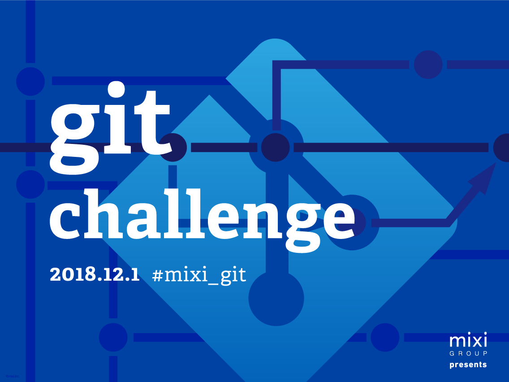

# mixi GROUP presents 「git challenge」

gitリポジトリに設けられた難題に挑む、競技型技術ワークショップイベント
---

「git challenge」とは、gitリポジトリに設けられた難題をチームワークで解決していく競技型技術イベントです。

今やソフトウェア開発ではもちろん、デザインや出版など何らかのデジタルデータを用いて進めるプロジェクトのインフラとなった git と GitHub。
業務でも起こりうる課題の解決を通し、プロの現場で必要なスキルの体験ができる、エンジニア志望学生のみなさんに向けたイベントです。
チームに分かれて git を用いたワークを行い、トラブルを解決していただきます。
難易度が徐々に高くなる課題をクリアしていきましょう！

2017年より新問題が登場するなど、毎回改善しながら、皆さんにお届けしています。
今後の開発において必要なスキルセットをこのイベントを通じて習得いただく機会になればという想いからこのイベントは開催されています。

git を使ったことがある皆さん、実力を試してみませんか？
挑戦をお待ちしております。

## Latest News:

### 第12回大会を開催します！

2019年10月26日(土)に git challenge#12 を開催します！

~~[git challenge#12 の応募方法や詳細はこちら](https://mixi-recruit.snar.jp/jobboard/detail.aspx?id=VcHJZYzSTDE)~~

募集は終了しました。

※応募(エントリーシート提出)〆切は10/06(日) 23:59まで！

### 第11回大会を開催しました！

区切りとなる第10回大会終えましたが、これからも git challenge は続きます！
運営メンバーに2019新卒を迎え第11回大会を開催しました！！！
さらに採点システムを刷新！？

当日の様子などは[こちら](events/11.md)

### 第11回開催記念インタビュー： アップデートされていくイベント「git challenge」〜その根底にある想い

- [アップデートされていくイベント「git challenge」〜その根底にある想い｜ミクシル](https://mixil.mixi.co.jp/information/4338)

### 記念すべき「第10回大会」を開催しました！

2015年11月にスタートした「git challenge」は次回で第10回目を迎えました。
アニバーサリー大会として特別企画もご用意して、今大会を盛り上げました！！

当日の様子などは[こちら](events/10.md)

## 過去の開催

- [第01回 2015/11/15](events/01.md)
- [第02回 2016/03/05](events/02.md)
- [第03回 2016/08/21](events/03.md)
- [第04回 2016/11/20](events/04.md)
- [第05回 2017/01/28](events/05.md)
- [第06回 2017/09/02](events/06.md)
- [第07回 2017/11/23](events/07.md)
- [第08回 2018/02/03](events/08.md)
- [第09回 2018/09/08](events/09.md)
- [第10回 2018/12/01](events/10.md)
- [第11回 2019/05/18](events/11.md)

### 過去参加された皆さんからのコメントをまとめてみました

- 終わってみると3時間半あっという間でした．脳の疲労が心地よかったです.
- git challengeでは「実際に遭遇するかもしれない問題」に"実際に遭遇する"ことができ、それに対して対処するということが経験出来ます.
- 普段から使っているgitですが、まだまだ知らないことは沢山あることが良く分かりました．
- 色々と丁寧に教えてくださったり環境を整えてくださったりしたメンターの方や運営の方々ありがとうございました.
- 他の人に薦めたいと思える非常に楽しいイベントでした.

## Links

### git challenge の新しい採点システムについて紹介した記事です (その１)

- [ギッチャレの新しい採点システム その１ - mixi developers - Medium](https://medium.com/mixi-developers/7b9387059366)

### 第10回で行ったことなどを記事にしました

- [git challenge 第10回に向けて+終えて - mixi developers - Medium](https://medium.com/mixi-developers/575d02a6602)

### 第9回開催記念インタビュー： 1年目エンジニア社員が語る git challenge の面白さとは？

- [求ム。「git」を追求したいchallenger。｜ミクシル](https://mixil.mixi.co.jp/information/2763)

### 「git challenge」は若手エンジニア社員が毎回改善を重ねながら、運営しています。

- [git challengeの自動採点高速化に向けたインフラのハナシ](http://alpha.mixi.co.jp/entry/2017/08/03/113000)

### git challengeではどのような問題が出題されるのか？

- [git challengeの出題内容を一部公開します - mixi engineer blog](http://alpha.mixi.co.jp/entry/2015/11/24/083300)
