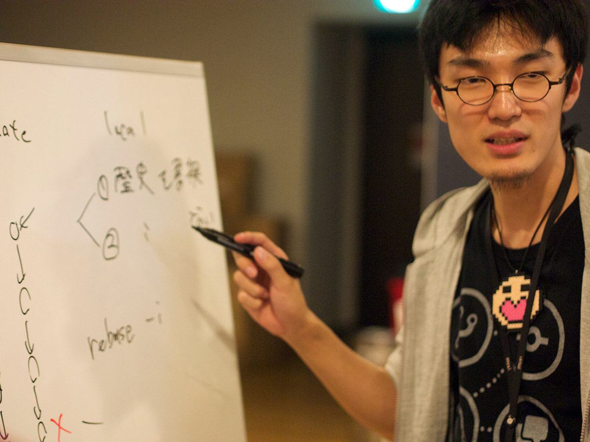
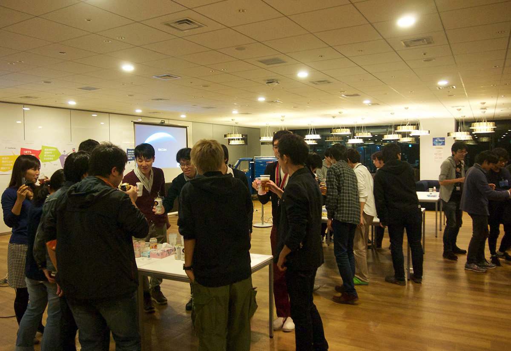
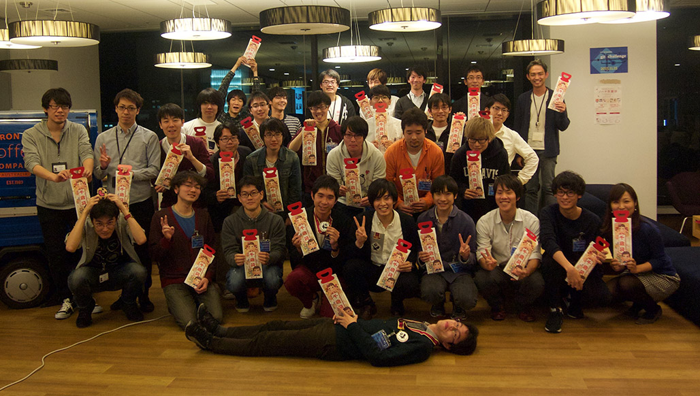

# 第01回 git challenge (2015.11.15)

## Links

- [git challenge 2015.11.15 - Togetterまとめ](http://togetter.com/li/900331)
- [学生向けイベント「git challenge」のご案内 - mixi Engineers' Blog](http://alpha.mixi.co.jp/entry/2015/10/16/114203)
- [技術イベントを会社探しと自分磨きに――Git勉強会を仕切るmixiの若きリファクター - ＠IT](http://www.atmarkit.co.jp/ait/articles/1512/10/news019.html)
- [Git Challenge 開催しました - 若き JavaScripter の悩み](http://orgachem.hatenablog.com/entry/2015/11/15/231222)
- [git challengeという技術イベントをやりました - なんか:かんがえて-6](http://blog.mrmt.net/entry/2015/11/16/210000)

### 参加者の記事

- [git challengeに参加してきたよ - 無限面のサイコロは球なのか？](http://maruuusa83.hateblo.jp/entry/2015/11/15/223917)
- [ミクシィのGit Challengeに参加した話 - プログラミングで世界を変える](http://kohki.hatenablog.jp/entry/mixi_git_challenge_2015)
- [git challengeに参加して3位だった - S_Shimotori’s diary](http://s-shimotori.hatenablog.com/entry/2015/11/15/212032)

## 様子など

### 前日の会場準備…

- http://twitter.com/HR_mixi/status/665110646350966784
- http://twitter.com/mixi_engineers/status/665111320384016384

### そして当日!

- http://twitter.com/mixi_engineers/status/665717435513729024
- http://twitter.com/kikuchy/status/665712121892618240
- http://twitter.com/kodam/status/665712169313406978
- http://twitter.com/orga_chem/status/665712148958482434

参加者もぞくぞくと…

- http://twitter.com/matsusaka_gyu/status/665712175277735936
- http://twitter.com/kobaken42/status/665712524810059776
- http://twitter.com/halhorn/status/665712174531112960
- http://twitter.com/splas_boomerang/status/665712378797883392
- http://twitter.com/imaizume/status/665718074692075521
- http://twitter.com/maruuusa83/status/665727698879123456
- http://twitter.com/kiy0p0n/status/665712646809763840

### そして、キーノートからスタート

- http://twitter.com/mixi_engineers/status/665715873525534720
- http://twitter.com/kiy0p0n/status/665712271440523264
- http://twitter.com/sinner_shiki/status/665712924225245184
- http://twitter.com/anthony_1618/status/665712975815159808
- http://twitter.com/halhorn/status/665717709670191104
- http://twitter.com/mixi_engineers/status/665722911706091520
- http://twitter.com/cfiken/status/665725640688070656
- http://twitter.com/mixi_engineers/status/665726478177316866
- http://twitter.com/shakuji/status/665727425251151872

### ここで、ランチタイム

今日のおひるごはんは、ちらしずし!

- http://twitter.com/matsusaka_gyu/status/665746587436449793

と、千歳飴!

- http://twitter.com/kiy0p0n/status/665748549364088833
- http://twitter.com/mixi_engineers/status/665752932558598144

さて、食後は少しくつろぎつつ…

- http://twitter.com/sinner_shiki/status/665749530365693953
- http://twitter.com/kiy0p0n/status/665749543791628288
- http://twitter.com/cfiken/status/665749665774637056
- http://twitter.com/mixi_engineers/status/665753311346212864

### 午後から、いよいよ競技開始!

さて、始まった…

- http://twitter.com/mixi_engineers/status/665758403025727488
- http://twitter.com/halhorn/status/665756259539292160
- http://twitter.com/mixi_engineers/status/665758568197435392
- http://twitter.com/kikuchy/status/665758988630294528
- http://twitter.com/cfiken/status/665768185644253188
- http://twitter.com/cfiken/status/665772981847658496

黙々とチャレンジしていくみんな…
(基本的に2人ずつのチームに分かれて問題を解いていきます)

- http://twitter.com/maruuusa83/status/665811047450734592
- http://twitter.com/kodam/status/665781602362880001
- http://twitter.com/cfiken/status/665814900225150976

### そして2年の時が流れた… (実際には4時間)

- http://twitter.com/imaizume/status/665816773027979264
- http://twitter.com/asakasakasas/status/665818727720488960
- http://twitter.com/moroku0519/status/665811411625340929
- http://twitter.com/splas_boomerang/status/665865046312906752

### おつかれさま。懇親会的なタイムだ

おつかれさまでした !!!

- http://twitter.com/tatarhy/status/665866037775220736

### 参加者のみなさんに いろいろブログエントリいただきました!

- http://twitter.com/sinner_shiki/status/665833494816292864
- http://twitter.com/maruuusa83/status/665886953489895424
- http://twitter.com/splas_boomerang/status/666133283474804737
- http://twitter.com/orga_chem/status/665895232651726849
- http://twitter.com/splas_boomerang/status/665909972413214720

Togetter中の人からもコメントいただきました! わーい!

- http://twitter.com/tg__dev/status/666506272859029504
- http://twitter.com/mixi_engineers/status/666558507882164226
- http://twitter.com/tg__dev/status/666560422682587136
