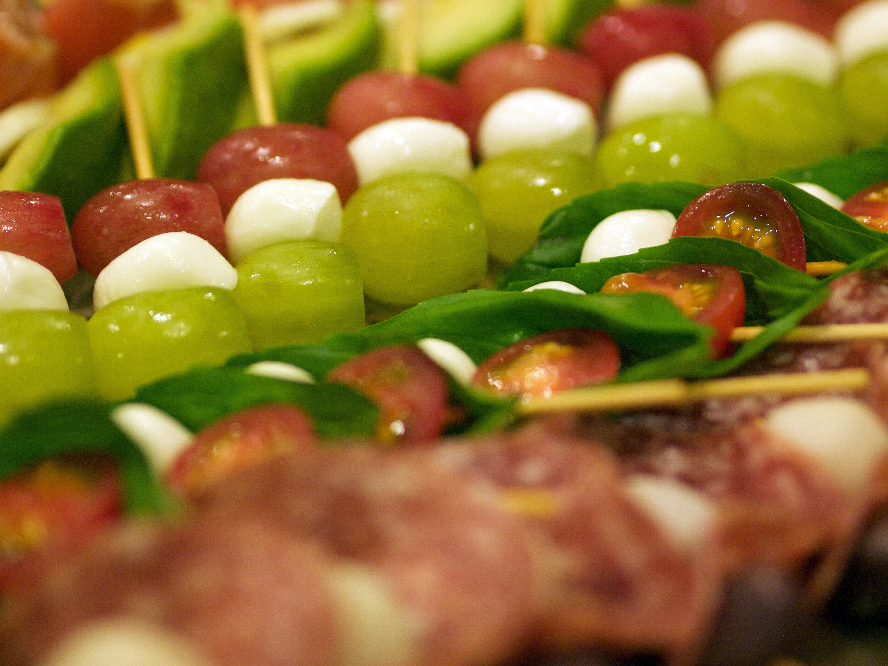

---
---

# 第01回 git challenge (2015.11.15)

## Links

- [git challenge 2015.11.15 - Togetterまとめ](http://togetter.com/li/900331)
- [学生向けイベント「git challenge」のご案内 - mixi Engineers' Blog](http://alpha.mixi.co.jp/entry/2015/10/16/114203)
- [技術イベントを会社探しと自分磨きに――Git勉強会を仕切るmixiの若きリファクター - ＠IT](http://www.atmarkit.co.jp/ait/articles/1512/10/news019.html)
- [Git Challenge 開催しました - 若き JavaScripter の悩み](http://orgachem.hatenablog.com/entry/2015/11/15/231222)
- [git challengeという技術イベントをやりました - なんか:かんがえて-6](http://blog.mrmt.net/entry/2015/11/16/210000)

### 参加者の記事

- [git challengeに参加してきたよ - 無限面のサイコロは球なのか？](http://maruuusa83.hateblo.jp/entry/2015/11/15/223917)
- [ミクシィのGit Challengeに参加した話 - プログラミングで世界を変える](http://kohki.hatenablog.jp/entry/mixi_git_challenge_2015)
- [git challengeに参加して3位だった - S_Shimotori’s diary](http://s-shimotori.hatenablog.com/entry/2015/11/15/212032)

## 様子など

### 前日の会場準備…





### そして当日!






参加者もぞくぞくと…








### そして、キーノートからスタート











### ここで、ランチタイム

今日のおひるごはんは、ちらしずし!



と、千歳飴!




さて、食後は少しくつろぎつつ…






### 午後から、いよいよ競技開始!

さて、始まった…








黙々とチャレンジしていくみんな…
(基本的に2人ずつのチームに分かれて問題を解いていきます)





### そして2年の時が流れた… (実際には4時間)





### おつかれさま。懇親会的なタイムだ

おつかれさまでした !!!



### 参加者のみなさんに いろいろブログエントリいただきました!





Togetter中の人からもコメントいただきました! わーい!




