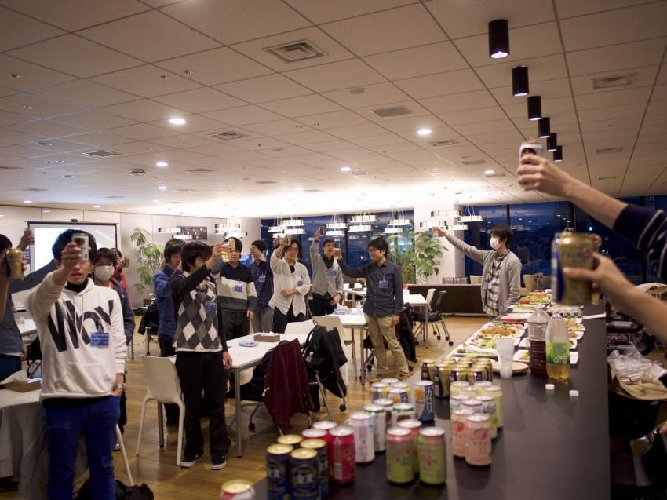
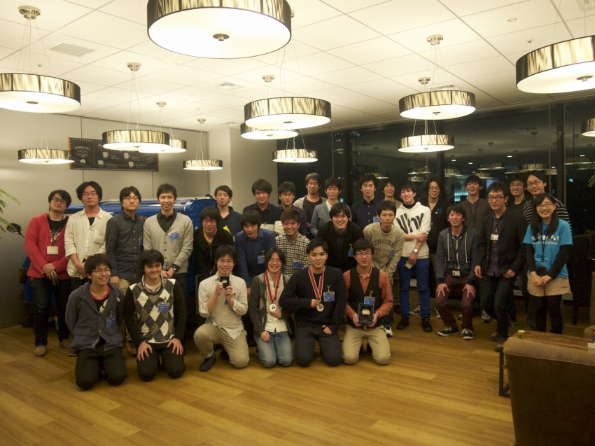

# 第02回 git challenge (2016.03.05)

ご好評にお応えし、git challenge 第2回を2016/3/5(土)に開催しました!
ご参加いただいたみなさんに、さっそくブログエントリをいくつもいただいています。
ありがとうございます!

## Links

### 参加者の記事

- [mixi git challenge に行ってきた(優勝した) - pockestrap](http://pocke.hatenablog.com/entry/2016/03/05/212422)
- [mixi git challengeに参加してきました！ - the glue](http://sweep3092.hatenablog.com/entry/2016/03/06/135751)
- [mixi git challenge に参加しました - jtwp470’s blog](http://jtwp470.hatenablog.jp/entry/2016/03/05/232502)
- [めざせGitマスター　〜Git Challengeに参加して学んだこと〜 - Qiita](http://qiita.com/vintersnow/items/434f734abbcc296bcce7)
- [mixi gitchallenge 参加してました！ - 勉強不足で至らんブログ](http://maketake.hatenablog.com/entry/2016/03/06/004519)
- [mixi のgit-challengeに行ってきたよ - つけじょにーのすぱげていコード](http://tukejonny-programming.hatenablog.com/entry/2016/03/05/mixi_のgit-challengeに行ってきたよ)
- [白鷹日誌 — git-challengeに参加してきた](ttps://whitehawk-taka.tumblr.com/post/140512698981/git-challengeに参加してきた)
- [git challengeに参加しました – KAGE's blog](http://www.kagemiku.com/blog/archives/36)
- [git-challengeすごく良かった！！ - vi ぺーた にっき ..](http://peetam175-water.hatenadiary.jp/entry/2016/03/07/162232)
- [＃mixi_git challengeに行ってきた - ' OR title = 'tasuten''s blog' --](http://tasuten.hatenablog.com/entry/2016/03/22/032914)
-

## 様子など

今回の開催では、挑戦する課題群をチーム数ぶん設置するためのprivate repos, そしてノベルティ面でもGitHub Japanさまにご提供・ご協賛いただきました。
どうもありがとうございました!

- http://twitter.com/mixi_engineers/status/700228818330456065
- http://twitter.com/mixi_engineers/status/700229087097294848

### 事前準備から…

この第2回のために、新しい設問も4問用意しました。
CI自動判定なども含めているので、一種の新規開発です。

- http://twitter.com/mixi_engineers/status/702299810192228353
- http://twitter.com/mixi_engineers/status/702301168584642560

そして、実際にその設問を解けるかどうか。動作テストも含めたレビューを、今回も内定者の皆さんにもお手伝いいただきました。

- http://twitter.com/mixi_engineers/status/702298924401299457
- http://twitter.com/sh19910711/status/706093275040448512

ほか、もろもろ準備も撮影快調!

- http://twitter.com/mixi_engineers/status/699496396328570880
- http://twitter.com/mixi_engineers/status/705704517975695361
- http://twitter.com/p_ck_/status/705683946739085312
- http://twitter.com/mixi_engineers/status/705936706805960704
- http://twitter.com/halhorn/status/705909795874693120
- http://twitter.com/mktakuya/status/705932775937994752
- http://twitter.com/jtwp470/status/705933527624388608
- http://twitter.com/tasuten/status/705936016301957120
- http://twitter.com/KAGE_MIKU/status/705936171302412290
- http://twitter.com/p_ck_/status/705936466992431104
- http://twitter.com/TaTeni8t8/status/705937760046047233
- http://twitter.com/nasa9084/status/705937870918291457
- http://twitter.com/sweep3092/status/705937324815814656

### キーノート

まずは @side_tana によるキーノートから

- http://twitter.com/tasuten/status/705938426432851968
- http://twitter.com/ABCanG1015/status/705939994787999744
- http://twitter.com/programmerMOT/status/705940730934480896
- http://twitter.com/p_ck_/status/705940966033608706
- http://twitter.com/nasa9084/status/705940965513515008
- http://twitter.com/p_ck_/status/705941987401183232
- http://twitter.com/kiy0p0n/status/705942496023441408
- http://twitter.com/sweep3092/status/705942535777046528
- http://twitter.com/ABCanG1015/status/705942538260119552
- http://twitter.com/mixi_engineers/status/705948836405993472
- http://twitter.com/jtwp470/status/705945329145761793
- http://twitter.com/mktakuya/status/705950741031055360

### お昼ごはん

キーノート、チュートリアルが済んだら、ひとまずみんなでお昼ごはん。お気に入り詳細を見る

- http://twitter.com/KAGE_MIKU/status/705952230487171072
- http://twitter.com/vintersn0w/status/705952698533687296

そして、会場にはGitHub Japanさまご提供のoctocatステッカーがいっぱい!

- http://twitter.com/KAGE_MIKU/status/705960330749280256
- http://twitter.com/nasa9084/status/705959004044832768

### 競技開始

- http://twitter.com/mixi_engineers/status/705970093184782336
- http://twitter.com/vintersn0w/status/705965886583123968
- http://twitter.com/KAGE_MIKU/status/705965405970411521

さすがに競技開始となると、みんな知見と頭脳をしぼりまくり。
TLは静かになります。

- http://twitter.com/mixi_engineers/status/705992674818428929
- http://twitter.com/KAGE_MIKU/status/705990971616460800

### そして…競技終了

- http://twitter.com/sweep3092/status/706014742804967425
- http://twitter.com/p_ck_/status/706014744960847873
- http://twitter.com/tasuten/status/706015834456522752
- http://twitter.com/KAGE_MIKU/status/706014748836564992
- http://twitter.com/nasa9084/status/706014492828667904
- http://twitter.com/vintersn0w/status/706014310632288256
- http://twitter.com/hikaru__m/status/706015547415068673
- http://twitter.com/mktakuya/status/706014568665845761
- http://twitter.com/jtwp470/status/706014763487096832
- http://twitter.com/int_tt/status/706015399045771264
- http://twitter.com/jtwp470/status/706014832999333888
- http://twitter.com/KAGE_MIKU/status/706016461156777984

### さて、問題解説

第2回では、問題解説を1時間に伸ばし、裏の仕掛けや疑問についてたっぷりご説明できるようにしました。

- http://twitter.com/KAGE_MIKU/status/706017110347030528
- http://twitter.com/KAGE_MIKU/status/706017887312478208
- http://twitter.com/halhorn/status/706019556347621377
- http://twitter.com/jtwp470/status/706019605957873664
- http://twitter.com/nasa9084/status/706020671944417280
- http://twitter.com/KAGE_MIKU/status/706020138068287488
- http://twitter.com/vintersn0w/status/706022681452244992
- http://twitter.com/sweep3092/status/706024907189039104
- http://twitter.com/KAGE_MIKU/status/706029572769251328
- http://twitter.com/nasa9084/status/706024201241505792
- http://twitter.com/KAGE_MIKU/status/706024776821673984
- http://twitter.com/vintersn0w/status/706034360483340288
- http://twitter.com/nasa9084/status/706025544391876608

### そして、優勝チームは…

- http://twitter.com/p_ck_/status/706037654144446468
- http://twitter.com/sweep3092/status/706037083685523456
- http://twitter.com/vintersn0w/status/706034746468380672
- http://twitter.com/p_ck_/status/706093215665946624
- http://twitter.com/sweep3092/status/706343083110043649

### そして最後は… 懇親会

- http://twitter.com/KAGE_MIKU/status/706040216516059136

おつかれさまでした!!!
