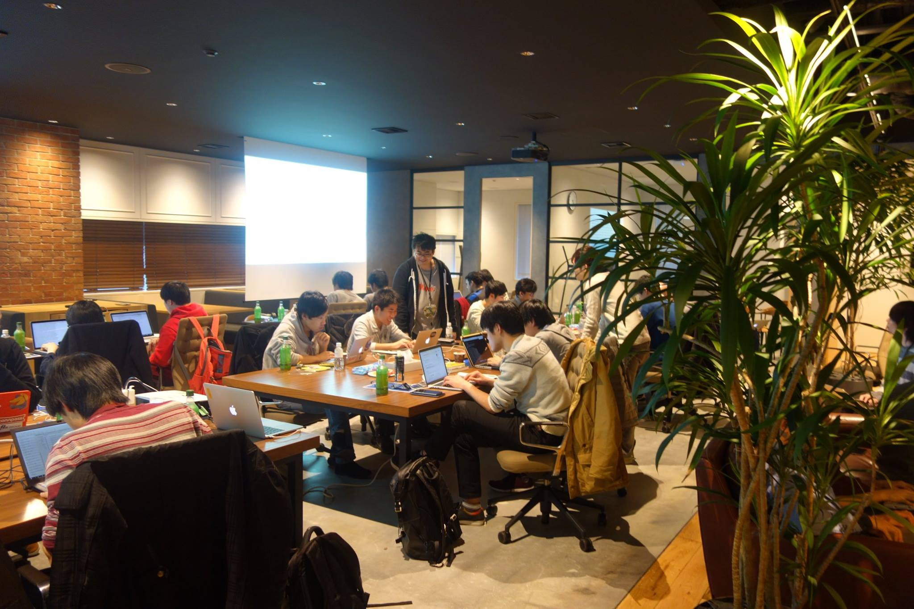

# 第05回 git challenge (2017.01.28)

今回も絶好のgit challenge日和のなかの第5回大会は、協議開始前に少々お待たせいたしましたが、無事終了。問題に悪戦苦闘しながらも、参加者全員が集中力を切らさず、取り組んでいらっしゃいました。

## Links

- [第5回「git challenge」の開催レポート！ - ミクシィグループ 人事部 採用ページ | Facebook](https://www.facebook.com/mixihr/posts/1826148860974429)

### 参加者の記事

- [第5回git challengeに行った | 順ちゃん寝る](http://narusejun.com/archives/15/)
- [ののかちゃんと戯れる : mixi gitchallenge に参加した話](http://alice.miuna.net/archives/69030289.html)
- [git challenge 2017.01.28 に行ってきた - きんめも](http://kinmemodoki.hatenablog.com/entry/2017/01/30/015704)
- [第5回 mixi git challengeに参加してきました - odan’s diary](http://odan3240.hatenablog.com/entry/2017/01/30/220446)
- [第5回 git challengeに参加してきた - 即席備忘録](http://show-go.hatenablog.com/entry/2017/01/30/155156)
- [第 5 回 git challenge に参加してきた #mixi_git - 新・オノマトペ的備忘録](http://gion.hatenablog.com/entry/5th-git-challenge)
- [第5回 git challenge に参加してきた - <%= shim's blog %>](http://shsm385.hatenablog.com/entry/2017/01/31/012526)
- [第5回git challengeに参加してきました - GPAが全てではない(と思いたいブログ)](http://soiya.hatenablog.jp/entry/2017/01/29/153730)
- [git challenge を終えて - ひげメモ](https://matsubara0507.github.io/posts/2017-01-28-after-the-git-challenge.html)

## 様子など







