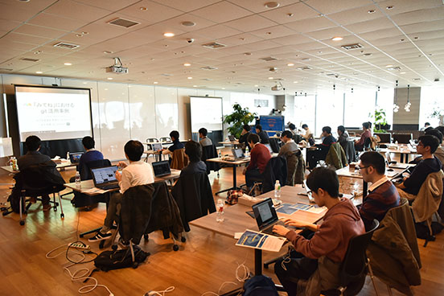

---
---

# 第08回 git challenge (2018.02.03)

節分の日に開催された第8回大会は、大会史上2回目となる「3チーム同時優勝」で幕を閉じました。Twitter上でも「#mixi_git」のハッシュタグを用いて、皆さん楽しく投稿もいただいておりました。

## Links

### 参加者の記事

- [git challenge ＃8 参加記 #mixi_git｜東京工業大学デジタル創作同好会traP](https://trap.jp/post/496/)
- [第8回gitchallengeに参加してきました #mixi_git - 豚平の落し蓋](http://tonpeidon.hatenablog.com/entry/2018/02/04/230933)
- [maeken's blog » 株式会社ミクシィのGit challengeに参加しました](https://ie.u-ryukyu.ac.jp/k178571/2018/02/03/mixi-git-challenge/)

## 様子など






